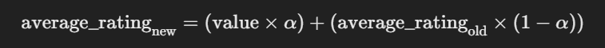
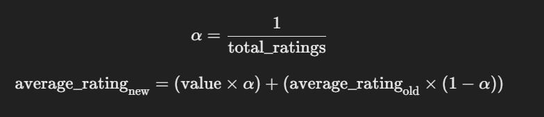

# Django Posts and Ratings Application
This application is a Django project that allows users to view a list of posts and rate them. 
Each post consists of a title and text. Users can rate posts with a value between 0 and 5. 
The application is designed to handle high performance under heavy load and includes mechanisms to mitigate the impact of sudden influxes of manipulative ratings.

## Installation
1. Clone the repository.
```bash
git clone https://github.com/Vyngard/bitpin-task.git
cd bitpin-task
```
2. Create a virtual environment and activate it.
```bash
# For Windows
python -m venv venv
source venv/Scripts/activate
```
3. Install the required packages.
```bash
pip install -r requirements.txt
``` 
4. Run the migrations.
```bash
python manage.py makemigrations
python manage.py migrate
```
5. Create a superuser.
```bash
python manage.py createsuperuser
```
6. Run the server.
```bash
python manage.py runserver
```
> [!IMPORTANT]
> There's already a superuser created with the name and password `bitpin` for testing purposes.   
> also there's a single post with `id=1` without any ratings, you can use it to test the application.

## API Endpoints
1. Posts List
    - URL: `/posts/`
    - Method: GET
    - Description: Returns a list of all posts.
    - Query Parameters:
      - `user_id` (optional): The identifier of the user to get their rating.
    - Example:
        ```bash
        curl -X GET 'http://127.0.0.1:8000/posts/?user_id=user1'
        ```
2. Create Post
    - URL: `/posts/create`
    - Method: POST
    - Description: Creates a new post.
    - Payload:
    ```json
   {
      "title": "Sample Post",
      "text": "This is a sample post."
   }
    ```
    - Example:
   ```bash
   curl -X POST 'http://127.0.0.1:8000/posts/create/' \
     -H 'Content-Type: application/json' \
     -d '{"title": "Sample Post", "text": "This is a sample post."}'
    ```
3. Submit Rating (Fixed ALPHA)
    - URL: `/rate/`
    - Method: POST
    - Description: Submits or updates a rating for a post using a fixed ALPHA value (0.1) for EMA.
    - Payload:
   ```json
   {
     "user_id": "user1",
     "post": 1,
     "value": 4.0
   }
    ```
    - Example:
        ```bash
      curl -X POST 'http://127.0.0.1:8000/rate/' \
      -H 'Content-Type: application/json' \
      -d '{"user_id": "user1", "post": 1, "value": 4.0}'

        ```
4. Submit Rating (Simple Average)
   - URL: `/rate_simple/`
   - Method: POST
   - Description: Submits or updates a rating for a post using the simple average calculation.
   - Payload:
   ```json
   {
     "user_id": "user1",
     "post": 1,
     "value": 4.0
   }
   ```
    - Example:
    ```bash
   curl -X POST 'http://127.0.0.1:8000/rate_simple/' \
     -H 'Content-Type: application/json' \
     -d '{"user_id": "user1", "post": 1, "value": 4.0}'
    ```
5. Submit Rating (Dynamic ALPHA)
    - URL: `/rate_dynamic/`
    - Method: POST
    - Description: Submits or updates a rating for a post using a dynamic ALPHA value based on the total number of ratings.
    - Payload:
    ```json
   {
     "user_id": "user1",
     "post": 1,
     "value": 4.0
   }
    ```
    - Example:
    ```bash
   curl -X POST 'http://127.0.0.1:8000/rate_dynamic/' \
     -H 'Content-Type: application/json' \
     -d '{"user_id": "user1", "post": 1, "value": 4.0}'
    ```
6. Reset Post
    - URL: `/reset_post/`
    - Method: POST
    - Description: Resets a post's total_ratings and average_rating to zero and deletes all associated ratings.
    - Payload:
    ```json
   {
     "post": 1
   }
    ```
    - Example:
    ```bash
   curl -X POST 'http://127.0.0.1:8000/reset_post/' \
     -H 'Content-Type: application/json' \
     -d '{"post": 1}'
    ```

## Switching Between Rating Methods
The application provides three endpoints for submitting ratings:

1. Fixed ALPHA Endpoint: `/rate/`
   - Uses a fixed smoothing factor (ALPHA = 0.1) in the EMA calculation.
2. Simple Average Endpoint: `/rate_simple/`
    - Calculates the average rating using the simple arithmetic mean.
3. Dynamic ALPHA Endpoint: `/rate_dynamic/`
    - Uses a dynamic `ALPHA` that adjusts based on the total number of ratings.   
To switch between methods, send your POST requests to the desired endpoint.

## Testing the Application
1. Create Sample Data
You can create posts using the Django admin interface or via the API.
Using Admin Interface:
    - Start the server `python manage.py runserver`
    - Go to `http://127.0.0.1:8000/admin/`
    - Log in with your superuser credentials.
    - Add new posts.
Using API:
```bash
curl -X POST 'http://127.0.0.1:8000/posts/create/' \
     -H 'Content-Type: application/json' \
     -d '{"title": "Sample Post", "text": "This is a sample post."}'
```
2. Submit Ratings
Submit ratings using the different endpoints and observe the differences in the average rating calculations.
```bash
curl -X POST 'http://127.0.0.1:8000/rate_dynamic/' \
     -H 'Content-Type: application/json' \
     -d '{"user_id": "user1", "post": 1, "value": 5.0}'
```
3. View Posts
Retrieve the list of posts to see the updated ratings.
```bash
curl -X GET 'http://127.0.0.1:8000/posts/?user_id=user1'
```

## Comparing Rating Methods (EMA vs Simple Average vs Dynamic EMA):
There is a file in the root directory named `simulate_ratings.py`. with this file you can see that if EMA methods actually work
or not, and how it can affect the average ratings of the users, if so many users start rating in the short period of time.   

To run the file:   
1- you need to change the Debug mode in the Django app. Go to `settings.py` file in the `app` directory and change the `DEBUG` variable to `True`.   
2- Also change the `ALLOWED_HOSTS` variable to `['*']`.   
3- Run the project first, to have the database ready.   
4- make sure that the post you want to test is already created. If the post already exists, make sure that it doesn't have any ratings.
5- Variables to edit:
```python
# simulate_ratings.py

post_id = 1  # Assuming a post with this ID exists
num_ratings = 20  # Number of users submitting ratings
ratings_values = [1, 5]  # Ratings values to simulate
method = EMA_URL  # Choose between EMA_URL, DYNAMIC_EMA_URL to compare it to Simple Average
```
6- Activate the virtual environment
```bash
source venv/Scripts/activate
```

7- run the script using
```bash
python simulate_ratings.py
```
7- you can see the results in the terminal.    

## Description of Average Rating Calculation Methods
1. **Simple Average Method (Implemented in: `views_simple_average.py`)**  
The Simple Average method calculates the average rating by taking the arithmetic mean of all the ratings submitted for a post. 
It is a straightforward calculation where each rating has an equal impact on the average.


2. **Fixed ALPHA Exponential Moving Average (EMA) Method (Implemented in: `views.py`)**   
The Fixed ALPHA EMA method calculates the average rating using an Exponential Moving Average formula with a fixed smoothing factor `(α) = 0.1`. 
This approach gives more weight to older ratings and less weight to new ones, providing a damping effect against sudden changes.

    

3. **Dynamic ALPHA Exponential Moving Average (EMA) Method (Implemented in: `views_dynamic_alpha.py`)**    
The Dynamic ALPHA EMA method improves upon the Fixed ALPHA EMA by adjusting the smoothing factor `(α) = 0.1` based on the total number of ratings. 
This allows the method to be more responsive when there are fewer ratings and more stable as the number of ratings increases.    

    

## Performance Considerations
- Denormalization: The `Post` model stores `total_ratings` and `average_rating` to avoid expensive aggregation queries when retrieving average ratings. This approach improves read performance by eliminating the need to compute these values on the fly.
- Atomic Transactions: Updates are performed within atomic transactions using the `@transaction.atomic` decorator. This ensures data integrity by guaranteeing that all database operations within a transaction are completed successfully or rolled back in case of an error.
- Efficient Updates: The application leverages `F` expressions and `update_or_create()` methods to perform atomic updates directly at the database level. This minimizes database hits and reduces the need to load objects into memory, enhancing performance and reducing the risk of race conditions.
- Concurrency Handling: The use of atomic database operations and careful transaction management allows the system to handle a high number of concurrent ratings efficiently. By avoiding unnecessary locks and leveraging the database's capabilities, the application maintains data integrity without sacrificing performance.